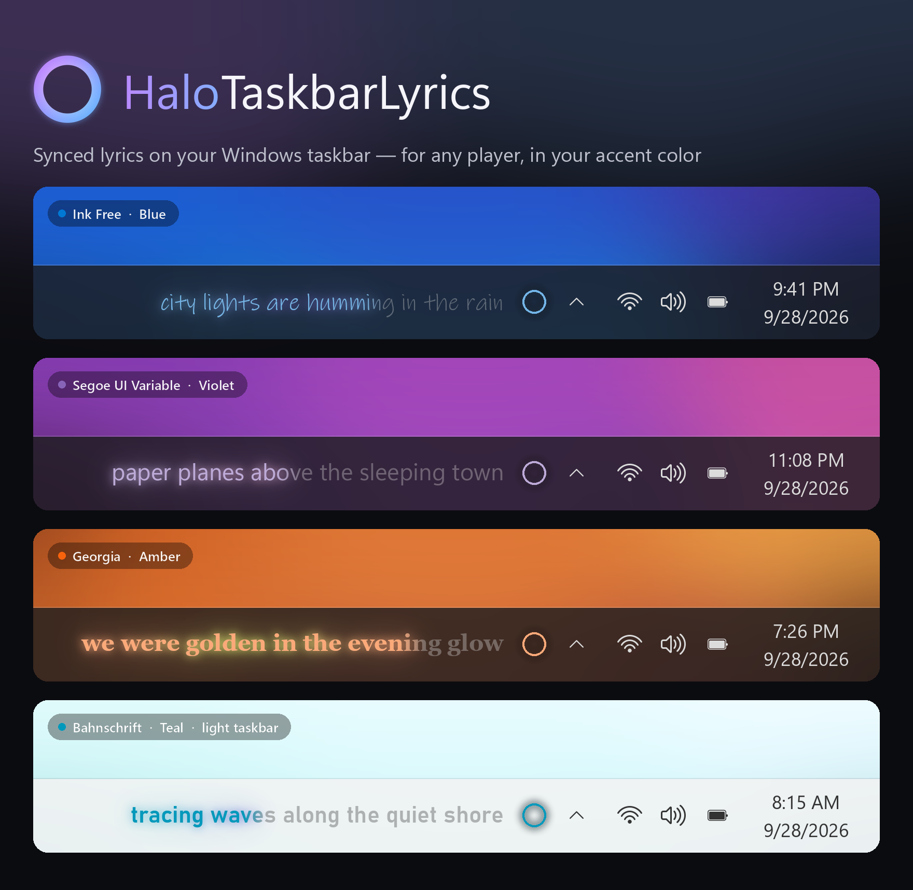
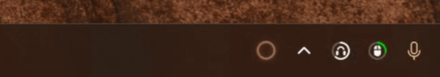

# HaloTaskbarLyrics





Текст песни, которая играет прямо сейчас, — одной строкой на панели задач Windows,
рядом с маленьким кольцом, которое «дышит» под музыку.

[English version](README.md)

## Возможности

- **Работает с любым плеером**, который виден в системных медиа-контролах Windows: Spotify,
  Яндекс Музыка, Apple Music, браузеры (YouTube, SoundCloud, VK…), Windows Media Player и другие.
- **Тексты** сначала ищутся в ваших `.lrc`-файлах в папке `Документы\Lyrics`, потом в
  [LRCLIB](https://lrclib.net) — бесплатно, без регистрации и ключей.
- **Живёт внутри панели задач**: прижимается к трею и двигается, когда значки появляются и
  исчезают, не моргает при сворачивании окон, прячется вместе с панелью в полноэкранных играх и видео.
- Пропетые слова плавно заливаются цветом, всплывающие буквы, мягкое свечение цветом акцента Windows, светлая и тёмная
  панель, любой системный шрифт или свой `.ttf`/`.otf`.
- Интерфейс на английском и русском.

## Скачать

Скачайте `HaloTaskbarLyrics.exe` из [последнего релиза](../../releases/latest) и запустите.
Это один небольшой файл, без установщика.

**Требования:**
- Windows 10 версии 2004 или новее либо Windows 11 (64-бит).
- [.NET 10 Desktop Runtime (x64)](https://dotnet.microsoft.com/download/dotnet/10.0) — или любой более
  новый .NET. Если его нет, при первом запуске Windows покажет сообщение; нажмите **Да**, и откроется
  страница загрузки Microsoft. Там выберите **.NET Desktop Runtime → Windows → x64**, установите
  и запустите HaloTaskbarLyrics ещё раз.

**«Система Windows защитила ваш компьютер»?** У exe пока нет цифровой подписи, поэтому SmartScreen
может предупредить о неизвестном издателе. Нажмите **Подробнее → Выполнить в любом случае**.
Файл можно сверить с контрольной суммой `.sha256`, которая лежит рядом в релизе.

## Как пользоваться

- **Правый клик** по кольцу (или по правой половине строки) — меню: шрифт и размер, эффекты,
  положение, сдвиг синхронизации для текущего трека, тема, язык, автозапуск.
- **Текст отстаёт или спешит?** *Синхронизация → Текст отстаёт / спешит* — сдвиг запоминается
  для каждого трека.
- **Свои тексты:** положите `Исполнитель - Название.lrc` в `Документы\Lyrics` (можно в подпапки).
- **Обновления:** программа раз в сутки проверяет GitHub и предлагает *Обновить до версии …*
  первым пунктом меню. Отключается в разделе *Обновления*.
- **Что-то работает не так?** *Диагностика → Записывать журнал диагностики*, повторите проблему,
  затем *Показать файл журнала* и приложите его к [issue](../../issues). В журнале технические
  сведения и названия треков, текстов песен там нет.

Настройки, кэш и журналы хранятся в `%LOCALAPPDATA%\HaloTaskbarLyrics`.

## Сборка из исходников

Нужен [.NET 10 SDK](https://dotnet.microsoft.com/download/dotnet/10.0).

```powershell
dotnet publish src/HaloTaskbarLyrics.csproj -c Release -o publish
# результат: publish\HaloTaskbarLyrics.exe
```

Релизы собирает GitHub Actions (`.github/workflows/release.yml`), когда отправлен тег `v*`.

## Ограничения

- В LRCLIB в основном построчные тайминги, поэтому заливка идёт по строке равномерно, а не по словам.
- Плеер должен сообщать позицию воспроизведения. Большинство сообщает, некоторые сайты — нет.
- Только основной монитор.

## Благодарности

Тексты — [LRCLIB](https://lrclib.net). Захват звука — [NAudio](https://github.com/naudio/NAudio).
Подробнее — [THIRD-PARTY-NOTICES.md](THIRD-PARTY-NOTICES.md).

## Лицензия

[MIT](LICENSE)
